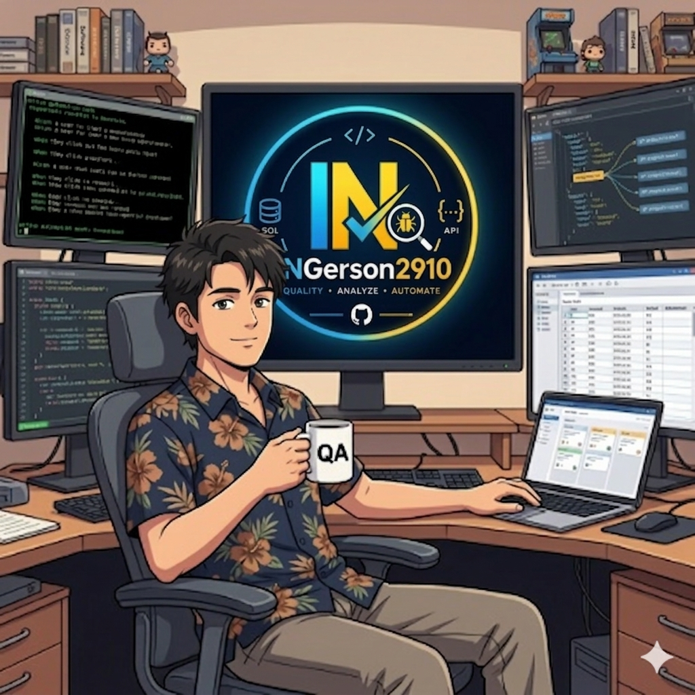

  

# Hi, I'm Gerson 👋  
### Senior QA Engineer | Functional Testing | API & SQL Testing | Automation in Progress

I'm a QA Engineer from Mexico with 4+ years of experience in software testing, mainly focused on functional testing, backend validation, API testing, SQL testing, UAT, regression testing, and defect management.

My experience has been mostly related to business-critical systems, where quality is not only about checking if a screen works, but also about validating data, business rules, backend processes, integrations, and expected results across different layers of the system.

---

## What I usually do as a QA Engineer

As part of my daily work, I usually focus on:

- Understanding requirements, user stories, and acceptance criteria
- Designing and executing test cases
- Performing functional, regression, UAT, API, and SQL testing
- Validating backend-driven flows and data consistency
- Reporting, tracking, and following up on defects
- Creating test evidence and documentation
- Collaborating with developers, Tech Leads, Product Owners, and QA teams
- Participating in Agile ceremonies such as refinements, sprint reviews, and defect triage

I enjoy going beyond the UI and understanding how the system behaves from a technical and business perspective.

---

## My current focus

Right now, I’m working on strengthening my profile as a hybrid QA Engineer.

My goal is to combine my functional testing experience with stronger technical skills in:

- Test automation
- Java
- Selenium WebDriver
- API testing
- SQL/database validation
- Test framework design
- QA documentation
- AI-assisted testing workflows

I know that growing into automation takes practice, consistency, and strong fundamentals, so I’m focused on improving step by step.

---

## Skills and tools

### QA & Testing

- Functional Testing
- Regression Testing
- UAT
- API Testing
- SQL Testing
- Backend Validation
- Test Case Design
- Defect Management
- Black-Box Testing
- White-Box Testing

### Tools

- Jira
- Azure DevOps
- Confluence
- Postman
- Panaya
- TestLink
- Xray
- Git
- GitHub
- GitLab

### Databases

- SQL Server
- PostgreSQL
- MySQL

### Automation & Technical Skills

- Selenium WebDriver
- Java
- TestNG
- JUnit
- Maven
- Allure Reports

### Currently improving

- Automation framework design
- Programming logic
- API automation
- Test data management
- Prompt engineering
- AI applied to QA

---

## Certifications

- ISTQB Certified Tester Foundation Level
- Scrum Master Professional Certificate
- DevOps Foundation Professional Certification
- Software Leader Professional Certification
- Microsoft Certified: Azure Fundamentals
- Generative AI Professional Certification

---

## What I’m working toward

My goal is to keep growing as a QA Engineer with a stronger technical foundation.

I want to contribute to software quality through:

- Clear requirement analysis
- Better test coverage
- Stronger backend and data validation
- Practical automation skills
- Continuous improvement
- Collaboration with technical and business teams

I believe good QA is not only about finding bugs. It is also about understanding the product, reducing risks, asking the right questions, and helping the team deliver more reliable software.

---

## A little more about me

Besides QA and technology, I enjoy reading, playing guitar, playing video games, going for walks, going to the movies, and watching movies or series at home.

I also love traveling, especially to places with beautiful natural landscapes. I really enjoy outdoor experiences and discovering places where I can disconnect, relax, and appreciate nature.

One of the things I value the most is spending quality time with my family. It helps me stay grounded, motivated, and focused on what really matters.

I like to keep myself in constant training because I believe continuous learning is key in technology, especially in QA, where tools, methodologies, and good practices are always evolving.

This GitHub profile is part of my professional journey. It helps me practice, document what I’m learning, and keep improving one step at a time.

Thanks for visiting my profile.

---

## Contact

- LinkedIn: [linkedin.com/in/gerson2910](https://linkedin.com/in/gerson2910)
- GitHub: [github.com/INGerson2910](https://github.com/INGerson2910)
- Portfolio: [ingerson2910.github.io](https://ingerson2910.github.io)
